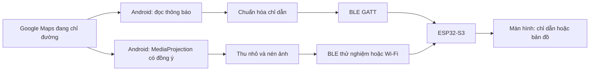

# Kế hoạch Pocketmate

> Đã được thay thế về hướng triển khai: người dùng xác nhận dùng iPhone và chọn chia sẻ màn hình Maps. Xem [kế hoạch iPhone hiện tại](iphone-screen-mirroring-plan.vi.md). Nội dung Android bên dưới được giữ làm khảo sát ban đầu, không còn là kế hoạch triển khai chính.

Ngày lập: 13/09/2026. Trạng thái: đề xuất thiết kế, chưa triển khai firmware/app.

## 1. Mục tiêu và điều đã biết

Người dùng mở Google Maps để chỉ đường trên điện thoại; thiết bị ESP32-S3 hiển thị thông tin cần nhìn, nhằm giảm việc lấy điện thoại ra khi di chuyển. Mục tiêu đầy đủ bao gồm hình bản đồ, không chỉ mũi tên.

Đã clone `https://github.com/HaPhanBaoMinh/pocketmate.git` về `/home/baominh/pocketmate`. Remote chưa có commit tại thời điểm kiểm tra. Đã đọc được ESP32-S3 revision v0.2, flash 16 MB và PSRAM 8 MB; xem [biên bản phần cứng](hardware-probe.md).

Kế hoạch dưới đây tạm lấy Android làm nhánh chính; hệ điều hành điện thoại và model màn hình chưa được người dùng xác nhận. Các thời gian và tốc độ mục tiêu là ước lượng kỹ thuật, chưa phải kết quả đo.

## 2. Chọn cách lấy nội dung từ điện thoại

| Phương án | ESP32 hiển thị | Còn dùng app Google Maps hiện có? | Điểm cần chứng minh |
|---|---|---|---|
| A. Android đọc thông báo chỉ đường → BLE | Mũi tên, khoảng cách, tên đường, ETA nếu có | Có, phải bắt đầu phiên chỉ đường | Thông báo thực tế có đủ dữ liệu; cập nhật khi khóa máy |
| B. Android chia sẻ màn hình → ảnh nén → BLE | Hình bản đồ Google Maps | Có | Tốc độ, chữ nhỏ, độ trễ và giới hạn khóa màn hình |
| B2. Chia sẻ màn hình → Wi-Fi; BLE ghép nối/điều khiển | Hình bản đồ với ngân sách truyền lớn hơn | Có | Thêm Wi-Fi, điện năng và vòng đời chia sẻ màn hình |
| C. App Pocketmate tự chạy Navigation SDK | Chỉ dẫn có cấu trúc; nghiên cứu bản đồ riêng tiếp theo | Nhập/chia sẻ điểm đến vào Pocketmate và bắt đầu phiên mới | SDK, billing, khả năng xuất hình và quyền sử dụng phù hợp |

**Đề xuất:** làm A để chứng minh chuỗi điện thoại → BLE → màn hình; chạy thử B sớm để quyết định có đạt mục tiêu bản đồ hay không. A là mốc trung gian. Nếu B không đạt yêu cầu, chọn B2 hoặc thay đổi trải nghiệm sang C trước khi đầu tư vào sản phẩm hoàn chỉnh.

Google Maps Intents dùng để mở Maps và khởi động điều hướng; tài liệu này không cung cấp luồng bản đồ/phiên điều hướng đang chạy để lấy qua BLE. Không thiết kế dựa trên giả định rằng ghép BLE là Maps tự phát dữ liệu. [Google Maps Intents](https://developer.android.com/guide/components/google-maps-intents).

Android có `NotificationListenerService` để nhận thông báo khi được người dùng cấp quyền. Đây là cơ chế hệ điều hành; định dạng thông báo Google Maps không phải giao thức dẫn đường được bảo đảm. Phải kiểm tra dữ liệu thật, không suy ra tuyến đường đầy đủ từ thông báo. [Android NotificationListenerService](https://developer.android.com/reference/android/service/notification/NotificationListenerService).

`MediaProjection` có thể chia sẻ nội dung màn hình/app, cần sự đồng ý cho từng phiên và có thể kết thúc khi khóa màn hình. Vì vậy nhánh B/B2 có xung đột thực tế với mục tiêu khóa điện thoại rồi cất đi. Đổi BLE sang Wi-Fi không giải quyết được giới hạn đó. [Android MediaProjection](https://developer.android.com/media/grow/media-projection).

Google Navigation SDK hỗ trợ app tự vận hành điều hướng và gửi chỉ dẫn ra màn hình nhỏ. Đây là phiên do app Pocketmate quản lý, không tự kế thừa phiên trong Google Maps. Feed chỉ dẫn không đồng nghĩa với ảnh bản đồ. [Custom navigation](https://developers.google.com/maps/documentation/navigation/android-sdk/intro-custom-nav), [turn-by-turn feed](https://developers.google.com/maps/documentation/navigation/android-sdk/tbt-feed).

Nếu dùng iPhone: không áp dụng nguyên kế hoạch Android. ANCS cung cấp thông báo cho phụ kiện, không phải luồng ảnh bản đồ; cần thử xem Google Maps thực sự phát dữ liệu nào. Nhánh app riêng phải kiểm tra Core Bluetooth, quyền chạy nền và SDK iOS; chưa cam kết lấy được phiên Maps khi khóa máy. [Apple ANCS](https://developer.apple.com/library/archive/documentation/CoreBluetooth/Reference/AppleNotificationCenterServiceSpecification/Specification/Specification.html).

## 3. Kiến trúc đề xuất



Điện thoại đảm nhiệm GPS, kết nối Internet, lấy tuyến đường và xử lý ảnh. ESP32 nhận dữ liệu, quản lý trạng thái kết nối và vẽ giao diện. Không cần mua thêm GPS cho kiến trúc này.

- Firmware: ưu tiên SDK/demo chính hãng bo để khởi động màn hình; nền ESP-IDF và NimBLE cho BLE. Chọn thư viện UI sau khi xác nhận driver và khả năng tương thích, LVGL là ứng viên.
- Android: Kotlin, giao diện ghép nối đơn giản, bộ đọc thông báo, bộ truyền BLE và service phù hợp cho kết nối nền.
- Tách `NavigationSource`, `Transport` và `DisplayRenderer` để thử nhiều nguồn/đường truyền mà không viết lại toàn bộ UI.
- Khóa phiên bản toolchain sau khi demo của nhà sản xuất chạy được; không tự gán chân SPI/RGB hoặc dung lượng buffer theo một bo khác.

Tham khảo [ESP-IDF NimBLE](https://docs.espressif.com/projects/esp-idf/en/stable/esp32s3/api-reference/bluetooth/nimble/index.html) và [Android BLE trong nền](https://developer.android.com/develop/connectivity/bluetooth/ble/background).

## 4. Các mốc triển khai và tiêu chí hoàn thành

| Mốc | Việc cần làm | Đầu ra và điều kiện đạt | Công dự kiến |
|---|---|---|---|
| P0: Chốt phần cứng | Xác định model/PCB; lấy schematic, demo và cấu hình flash/PSRAM; lưu firmware gốc trước lần nạp đầu | Có pin mapping đáng tin và phương án khôi phục | 0,5–1 ngày |
| P1: Chạy màn hình | Build demo; kiểm tra màu, hướng màn hình, backlight, font Việt, nút/touch nếu có | Màn hình chạy 30 phút, không lỗi màu/reset; ghi RAM và tốc độ vẽ | 1–2 ngày |
| P2: Thử nguồn Google Maps | App Android nhỏ nhận thông báo; kiểm tra lúc bắt đầu/rẽ/tính lại đường/kết thúc/khóa máy | Biết chính xác trường nào có thể lấy; mẫu đã bỏ dữ liệu riêng; quyết định A khả thi hay không | 1–2 ngày |
| P3: BLE với dữ liệu giả | GATT, ghép nối, protocol, hiển thị mũi tên và trạng thái | Truyền ổn định 30 phút, ngắt/nối lại đúng; kiểm tra gói thiếu/sai/thứ tự cũ | 1–2 ngày |
| P4: Chỉ dẫn thật | Ghép P2/P3; parser tiếng Việt/Anh; xử lý dữ liệu thiếu và service nền | Điện thoại đang dẫn đường, ESP hiển thị thông tin tương ứng; khóa máy 30 phút vẫn hoạt động trên điện thoại thử nghiệm | 2–4 ngày |
| P5: Thử bản đồ đầy đủ | Chia sẻ riêng cửa sổ Maps khi hệ điều hành hỗ trợ; resize/nén; benchmark BLE; thử Wi-Fi nếu cần | Báo cáo FPS, độ trễ, khả năng đọc chữ, nhiệt/pin, hành vi khóa máy; quyết định tiếp tục hay đổi nhánh | 2–4 ngày |
| P6: Hoàn thiện sử dụng | UI ngoài trời, reconnect, cấp nguồn, giá đỡ/vỏ, thử chuyến đi | Đạt ma trận kiểm thử bên dưới, có hướng dẫn phục hồi và dùng hàng ngày | 3–5 ngày |

P2 nên được làm sớm ngay cả khi đang chờ thông tin màn hình. P5 phải có thử nghiệm vòng đời chia sẻ màn hình ngay đầu mốc, trước khi tối ưu truyền ảnh. Sau mỗi mốc cập nhật lại ước lượng bằng kết quả đo.

Tổng khoảng 11–20 ngày công cho một người có kinh nghiệm nếu đi được nhánh Android A/B và có demo bo tốt. Đây không phải cam kết hoàn tất bản đồ: thiếu driver, thay đổi sang iPhone hoặc app Navigation SDK có thể cần thêm thời gian đáng kể.

## 5. Giao thức BLE phiên bản đầu

ESP32 là peripheral/GATT server; điện thoại là central/client. BLE phù hợp với chip đã đọc được. [ESP32-S3 BLE](https://docs.espressif.com/projects/esp-idf/en/latest/esp32s3/api-guides/ble/overview.html).

- `Capabilities` (read): phiên bản protocol, kích thước màn hình, định dạng ảnh hỗ trợ, giới hạn nhận.
- `Navigation` (write): trạng thái, thao tác rẽ, khoảng cách, tên đường, ETA nếu nguồn có.
- `Control` (write có phản hồi): bắt đầu/kết thúc, cấu hình độ sáng, đồng bộ snapshot sau reconnect.
- `Status` (notify): ACK, lỗi, mức buffer, thông tin firmware; pin chỉ khi phần cứng đo được.

Dùng JSON dễ kiểm tra ở prototype; chuyển định dạng gọn chỉ sau khi đo. Mỗi message cần `protocol_version`, `session_id`, `seq`, `type`, `payload_length`. Mọi độ dài phải được kiểm tra trước khi cấp phát. Dùng meter/second cho số liệu có cấu trúc; nếu chỉ có text thì giữ text và đánh dấu unknown thay vì tự tạo số.

Không giả định MTU cố định: thương lượng và chia gói theo dung lượng ATT thực tế, trừ cả header ứng dụng. Có timeout lắp ráp, giới hạn tổng message, ACK theo message và hàng đợi hữu hạn. Với ảnh: thêm frame ID, offset, kích thước tổng, checksum; bỏ frame cũ khi có frame mới, chỉ trình bày ảnh đã nhận đủ.

Chỉ chấp nhận điện thoại đã ghép; dùng bonding/encryption và xác nhận ghép trên màn hình/nút nếu có. Có thao tác xóa ghép nối. Không quảng bá tên đường hoặc tọa độ trong BLE advertisement.

Tách hai loại trạng thái: kết nối BLE còn sống và nguồn điều hướng còn hợp lệ. Heartbeat chứng minh app còn chạy, không chứng minh Google Maps đã phát chỉ dẫn mới. Lưu tuổi dữ liệu; khi nguồn không xác nhận được trạng thái thì báo chưa cập nhật, không giả định mũi tên cũ vẫn đúng. Ngưỡng này cần chỉnh sau khi đo nhịp thông báo trên đoạn đường dài.

## 6. Ngân sách truyền ảnh và bộ nhớ

Ví dụ giả định màn hình 240 × 320, RGB565, không phải độ phân giải đã xác nhận của bo:

- Một frame thô: `240 × 320 × 2 = 153.600 byte`, tức 150 KiB.
- Hai framebuffer: 300 KiB, chưa gồm UI, decoder, Wi-Fi/BLE và DMA buffer.
- Hai frame/giây thô: `153.600 × 2 × 8 = 2,4576 Mbit/s`, chưa tính overhead.
- Nếu ảnh nén giả định 20 KiB/frame, 2 FPS cần khoảng 328 kbit/s payload. Kích thước nén thật phụ thuộc bản đồ và chất lượng chữ.

PSRAM 8 MB tạo dư địa cho buffer nhưng không bảo đảm mọi buffer/DMA đều đặt được trong PSRAM. Đo heap nội bộ, khối cấp phát liên tục lớn nhất, thời gian decode và flush màn hình. Không suy throughput ứng dụng từ tốc độ PHY của BLE.

Thử 1 FPS trước, rồi 2–5 FPS nếu đường truyền cho phép. Đo từ capture đến lúc vẽ xong, không chỉ tốc độ gửi. Nếu trễ tăng do backlog thì giảm chất lượng/độ phân giải hoặc bỏ frame, không xếp hàng vô hạn. Giữ thông tin bản quyền/attribution đọc được khi thử hình bản đồ; thẩm định cách xuất/hiển thị nội dung trước khi phát hành nhánh API riêng.

Wi-Fi là nhánh thay đổi yêu cầu BLE-only, cần quyết định dựa trên phép đo. Thử ESP32 tham gia hotspot 2,4 GHz của điện thoại; kiểm tra đường truyền tới app và điện thoại vẫn có Internet. Bảo vệ phiên truyền bằng thông tin phiên trao đổi sau ghép nối; đo cả trường hợp BLE và Wi-Fi hoạt động đồng thời.

## 7. Giao diện và trải nghiệm

Màn hình chính của MVP gồm mũi tên lớn, khoảng cách, tên đường tối đa hai dòng, ETA nếu có và trạng thái kết nối nhỏ. Chế độ bản đồ cần giữ nhãn và hướng đi đọc được ở kích thước thật, không chỉ thu nhỏ toàn bộ màn hình điện thoại.

Luồng sử dụng dự kiến: ghép thiết bị một lần → cấp quyền cần thiết → mở Google Maps và bắt đầu chỉ đường → xem ESP32. Nhánh chia sẻ màn hình có bước cấp quyền mỗi phiên; không hứa tự động hoàn toàn hoặc chạy tiếp sau khóa máy.

Hiển thị rõ các trạng thái: chờ kết nối, đã nối/chưa có hành trình, đang dẫn đường, nguồn chưa cập nhật, mất kết nối, đã kết thúc. Chỉ hiện đang tính lại đường khi nguồn báo được trạng thái đó. Không suy ra đã đến nơi chỉ vì notification biến mất.

## 8. Ma trận kiểm thử trước khi dùng hàng ngày

| Nhóm | Tình huống bắt buộc | Điều kiện đạt đề xuất |
|---|---|---|
| Nguồn chỉ dẫn | Rẽ trái/phải, đi thẳng, vòng xuyến, quay đầu, đường dài, reroute, kết thúc | Không đoán hướng khi thiếu dữ liệu; xóa/chuyển trạng thái đúng khi dừng |
| Điện thoại | Khóa màn hình, tiết kiệm pin, thu hồi quyền, app bị tắt, Maps cập nhật | Có kết quả đo cho máy/OS thử; lỗi được báo rõ trên ESP |
| BLE | Ra khỏi tầm, tắt/bật Bluetooth, reboot ESP, gói chia nhỏ/hỏng | Không crash; đồng bộ snapshot mới sau nối lại, không phát lại gói cũ |
| Độ trễ chỉ dẫn | Đo từ lúc app nhận dữ liệu đến vẽ xong | Mục tiêu p95 dưới 1 giây; báo riêng độ trễ nguồn Maps |
| Reconnect | 20 lần ngắt/nối có chủ ý | Mục tiêu nối lại dưới 10 giây khi cả hai bên sẵn sàng |
| Hình bản đồ | Đo FPS, frame age, chữ, đổi hướng màn hình, khóa máy | Không đưa ảnh cũ thành ảnh đang trực tiếp; quyết định chấp nhận dựa trên số đo |
| Nguồn và nhiệt | Chạy ít nhất 2 giờ; đo dòng theo độ sáng và transport | Không brownout/reset; thời lượng pin tính từ số đo và pin thực tế |
| Thực địa | Ngoài nắng, rung, vị trí gắn, mưa nếu có vỏ phù hợp | Đọc nhanh được; thử ban đầu khi đứng yên hoặc có người khác điều khiển xe |

Chưa thể xác nhận chống nước hoặc khả năng sạc pin từ nhận dạng chip. Giai đoạn bàn thử dùng nguồn USB phù hợp; chọn pin, mạch nguồn và vỏ sau khi xác định bo và đo dòng.

## 9. Cấu trúc repo dự kiến và việc tiếp theo

```text
pocketmate/
  README.md
  docs/                  # Kế hoạch, phần cứng, protocol, kết quả đo
  firmware/              # ESP32; tạo sau khi chốt board support
  android/               # Companion app nếu xác nhận Android
  tools/                 # Bộ gửi dữ liệu giả và đo throughput
  test-fixtures/         # Mẫu chỉ dẫn đã loại dữ liệu riêng
```

Hiện chỉ README và tài liệu đã được tạo. Firmware, app và các thư mục triển khai trên là đề xuất. Tài liệu đang ở local, chưa commit/push.

Thông tin cần bổ sung để bắt đầu triển khai đúng: Android hay iPhone và phiên bản OS; link/model bo có màn hình; yêu cầu khóa/tắt màn hình điện thoại có bắt buộc không; BLE-only có bắt buộc không nếu phép đo truyền ảnh không đạt. Việc độc lập có thể bắt đầu trước là chốt protocol và làm bộ thử nguồn dữ liệu trên hệ điều hành được xác nhận.
