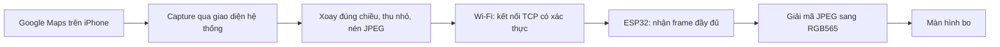

# Pocketmate: iPhone chia sẻ hình Google Maps sang ESP32-S3

Ngày cập nhật: 13/09/2026. Đây là kế hoạch, chưa triển khai app/firmware.

Thông tin người dùng đã xác nhận: iPhone 11, iOS 18.1.1, không có Mac. Nếu triển khai truyền hình, chọn nhánh ReplayKit để thử. Build/ký iOS cần môi trường macOS từ xa hoặc mượn Mac; chưa thiết lập CI hay tài khoản trả phí. Người dùng quan tâm hướng BLE không cần app; ANCS là nhánh thử thông báo, chưa thay thế được mục tiêu truyền hình bản đồ.

Đã xác nhận bằng rút/cắm USB và đọc lại esptool: bo thực tế là ESP32-S3, flash 16 MB, PSRAM 8 MB. Link/ảnh LCDWiki ESP32-32E 2.8 inch người dùng cung cấp không khớp chip thực tế. Xem [đối chiếu phần cứng](hardware-probe.md); cần ảnh chụp bo thực tế hoặc tài liệu đúng biến thể để chốt driver và sơ đồ chân.

## 1. Quyết định và điều kiện còn mở

Đã xác nhận: dùng iPhone; giữ Google Maps làm ứng dụng điều hướng; muốn truyền hình bản đồ sang bo ESP32-S3 có màn hình. Phần cứng đã đọc: ESP32-S3, flash 16 MB, PSRAM 8 MB. Chưa biết driver, độ phân giải và chân màn hình.

Đề xuất kiến trúc: iPhone thu màn hình → thu nhỏ/nén JPEG → Wi-Fi nội bộ → ESP32 giải mã/vẽ. BLE là phần ghép nối/cấu hình tùy chọn về sau. Wi-Fi là đề xuất cần người dùng xác nhận vì yêu cầu ban đầu nói BLE; chưa coi đây là lựa chọn đã được duyệt.

Prototype ban đầu giả định Google Maps ở foreground và iPhone không khóa, độ sáng thấp. Không hứa truyền bản đồ đang cập nhật sau khi khóa máy. Nếu bắt buộc khóa máy, thử điều kiện này trước khi làm các phần còn lại; nếu không đạt thì phải thay đổi kiến trúc cùng người dùng.

## 2. Capture trên iPhone: chốt theo phiên bản iOS

Tài liệu Apple hiện giới thiệu ScreenCaptureKit trên iOS từ 27.0; ReplayKit `RPBroadcastSampleHandler` được đánh dấu deprecated từ 27.0. Không suy ra deprecated nghĩa là API chắc chắn không chạy; cũng không lấy API mới làm yêu cầu nâng cấp điện thoại. Chốt SDK và deployment target theo iPhone thực tế. [ScreenCaptureKit](https://developer.apple.com/documentation/screencapturekit), [ReplayKit sample handler](https://developer.apple.com/documentation/replaykit/rpbroadcastsamplehandler).

| Phiên bản trên máy thử | Nhánh thu hình để kiểm chứng |
|---|---|
| iOS trước 27, có ReplayKit broadcasting phù hợp | App Swift + Broadcast Upload Extension; người dùng bắt đầu broadcast qua giao diện hệ thống; extension nhận video sample buffer |
| iOS 27 trở lên | Thử mẫu ScreenCaptureKit chính thức; system sharing picker → full-display capture → output frame; cấu hình background capture đúng SDK |

Mẫu ScreenCaptureKit iOS của Apple phân biệt full-display capture và in-app capture. Để nhìn thấy Google Maps khi chuyển app, phải thử full-display capture. Không giả định in-app capture của Pocketmate có thể lấy màn hình Google Maps. [Mẫu capture trên iOS](https://developer.apple.com/documentation/screencapturekit/capturing-screen-content-on-ios).

Với ReplayKit, vòng đời thu hình và gửi ảnh phải nằm trong Broadcast Upload Extension, không dựa vào app Pocketmate tiếp tục chạy foreground sau khi mở Maps. Chia sẻ cấu hình app/extension bằng App Group nếu team signing hỗ trợ; kiểm tra entitlement trước khi chọn. Không dùng riêng recorder chỉ thu nội dung của app Pocketmate để giải quyết capture Maps. [ReplayKit security](https://support.apple.com/en-gb/guide/security/seca5fc039dd/web), [App Groups](https://developer.apple.com/documentation/xcode/configuring-app-groups).

Tách adapter thu hình khỏi encoder và protocol; bản đầu chỉ hiện thực nhánh khớp iPhone của người dùng. Người dùng chủ động bắt đầu phiên chia sẻ. Không thiết kế tự bật capture ngầm khi BLE kết nối.

## 3. Kiến trúc và trải nghiệm

Luồng sử dụng mục tiêu:

1. Bật ESP32 và kết nối cùng mạng với iPhone.
2. Mở Pocketmate, chọn thiết bị, xác nhận ghép và xem trạng thái sẵn sàng.
3. Bắt đầu chia sẻ bằng giao diện iOS; không bật mic.
4. Chuyển sang Google Maps, chọn điểm đến và bắt đầu dẫn đường.
5. ESP32 hiển thị hình Maps; cấu hình độ sáng iPhone thấp và giữ Maps hiển thị trong bản thử.
6. Khi kết thúc, dừng chia sẻ; ESP32 về màn hình chờ.

Luồng này hiển thị hình ảnh một chiều. Các thao tác chọn tuyến, tìm địa điểm và zoom vẫn thực hiện trên điện thoại khi dừng; không thêm điều khiển chạm ngược Google Maps từ ESP32 vào MVP.

Capture toàn màn hình có thể gửi cả ứng dụng khác hoặc nội dung riêng khi người dùng chuyển app. App phải giải thích đúng phạm vi; có nút dừng và xử lý pause. Không hứa tự nhận diện/lọc riêng Maps. Không truyền audio, không lưu video vào Photos và không gửi ảnh lên server trong thiết kế này.

## 4. Mạng Wi-Fi để thử và để dùng ngoài đường

**Bàn thử:** cho iPhone và ESP32 vào cùng Wi-Fi 2,4 GHz hoặc router có các băng tần thông nhau. Thử unicast tới địa chỉ được nhập thủ công trước để tách lỗi kết nối khỏi lỗi discovery. Hoàn tất quyền Local Network trong app trước khi chuyển sang Maps. [Apple local network privacy](https://developer.apple.com/documentation/technotes/tn3179-understanding-local-network-privacy).

**Ngoài đường:** ưu tiên thử ESP32 tham gia Personal Hotspot của iPhone. Trên iPhone hỗ trợ, bật Maximize Compatibility để dùng 2,4 GHz. Không mặc định IP ESP32 cố định hoặc app chắc chắn truy cập được client hotspot: xác minh luồng iPhone → ESP32 trên máy thật. [Apple Wi-Fi security](https://support.apple.com/en-ca/guide/security/secfd166f620/web).

Nhập cấu hình hotspot cho ESP32 qua USB trong bản đầu, tránh đưa BLE provisioning vào đường găng. Sau khi dữ liệu ảnh chạy ổn mới thêm giao diện cấu hình thuận tiện. Không commit mật khẩu Wi-Fi.

Nếu hotspot không hoạt động đúng, thử ESP32 SoftAP hoặc router di động. Với SoftAP không Internet phải kiểm chứng iPhone vẫn dùng dữ liệu di động cho Maps; không coi đây là bảo đảm. Không cần mua router trước khi thử hotspot.

Nếu người dùng bắt buộc BLE-only: thay transport bằng một nhánh đo riêng, gồm quyền truy cập Core Bluetooth trong đúng tiến trình capture, MTU thực tế, flow control và throughput. Không mặc định app chính bị đưa vào nền sẽ tiếp tục chuyển ảnh hộ extension. Chốt FPS theo phép đo, không áp dụng mục tiêu Wi-Fi cho BLE.

## 5. Định dạng ảnh, protocol và bộ nhớ

Chọn JPEG từng frame độc lập cho prototype vì phục hồi đơn giản khi mất frame. ESP32 chỉ nhận kích thước phù hợp màn hình, không nhận ảnh nguyên độ phân giải iPhone. Chưa thêm codec video liên frame vào MVP.

- App chuẩn hóa orientation, thu nhỏ giữ tỷ lệ rồi nén. Thử chất lượng JPEG 50/65/80 và 1/2/5 FPS; chọn theo độ rõ tên đường và độ trễ.
- Mặc định hiển thị toàn frame với khoảng trống nếu lệch tỷ lệ. Chỉ crop vùng Maps khi đã xem kích thước thật và giữ đủ chỉ dẫn, vị trí hiện tại, thông tin attribution.
- TCP stream có framing: magic, protocol version, session ID, frame sequence, width/height, codec, payload length và checksum. Định nghĩa byte order, giới hạn kích thước và timeout trước khi code.
- Receiver đọc đúng số byte, không giả định một lần read là đủ một frame. Từ chối kích thước ảnh, độ dài, codec không hỗ trợ trước khi giải mã/cấp phát.
- Dùng xác thực phiên ghép và TLS với danh tính thiết bị được xác nhận khi ghép; đo chi phí RAM/TLS trên ESP32. Không gửi ảnh cho endpoint chỉ vì trùng tên mDNS.
- Bản đầu tối đa một frame đang gửi và một frame mới nhất chờ; ACK khi frame đã được vẽ. Bỏ frame chờ cũ khi có frame mới. Mạng chậm phải giảm FPS, không để TCP backlog tăng vô hạn.
- Callback capture trả về sớm, hàng đợi xử lý có giới hạn, tái sử dụng context/buffer; đo footprint tiến trình capture thay vì giữ nhiều ảnh full-resolution.
- ESP32 dùng buffer ảnh nén và framebuffer trong PSRAM nếu driver cho phép; buffer DMA/internal RAM theo yêu cầu driver. Không giả định toàn bộ 8 MB dùng được cho DMA.

Ví dụ giả định màn hình 240 × 320: RGB565 = 150 KiB/frame; hai framebuffer = 300 KiB. Nếu JPEG đo được 20–40 KiB/frame thì 5 FPS cần khoảng 0,82–1,64 Mbit/s payload, chưa có overhead. Đây là phép tính từ giả định, không phải kết quả benchmark của bo.

Mục tiêu thử nghiệm Wi-Fi: bắt đầu 2 FPS, nâng 5 FPS nếu chữ rõ và không quá nhiệt; p95 capture-to-display dưới 500 ms là mục tiêu tối ưu, dưới 1 giây là ngưỡng prototype đề xuất. Đo bằng đồng bộ clock có ước lượng sai số hoặc quay cả hai màn hình, không lấy hai timestamp khác đồng hồ trừ trực tiếp.

## 6. Các bước triển khai

| Mốc | Công việc | Kết quả bắt buộc | Ước lượng |
|---|---|---|---|
| I0: Chốt điều kiện | Lấy model/iOS, Mac/Xcode, signing team, link bo; xác nhận Wi-Fi và khóa máy | Chọn được capture API, đường cài app và driver | 0,5–1 ngày |
| I1: Chứng minh thu được Maps | App capture tối thiểu → receiver trên máy tính, cùng LAN; chuyển Pocketmate sang Maps; thử lock/unlock và cuộc gọi | Hình Maps thật đến receiver, log vòng đời/độ trễ; quyết định có đáp ứng nhu cầu khóa máy không | 1–3 ngày |
| I2: Khởi động màn hình | Sao lưu firmware; build demo hãng; vẽ ảnh test, font nhỏ, xoay màn hình, đo heap | Chốt resolution/pin mapping và khả năng đọc chữ | 1–2 ngày |
| I3: ESP nhận JPEG | Dùng sender trên Linux gửi ảnh test qua Wi-Fi; ghép/xác thực, framing, decode, ACK, stale timeout | 30 phút không reset, từ chối frame lỗi/oversize đúng | 2–3 ngày |
| I4: Nối iPhone → ESP | Ghép capture/resize/encoder/transport; xử lý background theo API đã chọn | Maps xuất hiện trên màn hình bo; receiver chạy khi app Pocketmate không foreground | 2–3 ngày |
| I5: Thử ngoài LAN | Personal Hotspot 2,4 GHz; chuyển mạng, ngắt/nối, quyền mạng, Maps dùng data | Có kết quả trên chính iPhone; ổn định một giờ và phục hồi đúng | 1–2 ngày |
| I6: Tối ưu và hoàn thiện | Chất lượng ảnh, crop tùy chọn, pin/nhiệt, vỏ/nguồn, test hai giờ | Đạt các ngưỡng đã chốt, hướng dẫn dùng và giới hạn được ghi rõ | 3–5 ngày |

Tổng 10,5–19 ngày công, làm tròn khoảng 11–19 ngày cho một người có kinh nghiệm. Chưa gồm chờ thiết bị, tài khoản, entitlement hoặc xử lý driver thiếu tài liệu. Sau I1 và I2 phải ước lượng lại. Thử BLE-only hoặc thêm hỗ trợ nhiều đời iOS là phạm vi bổ sung.

I1 là bước quyết định đầu tiên: có thể thực hiện khi chưa biết model màn hình. I2/I3 cũng có thể làm độc lập trên Linux khi đã có tài liệu bo. Không cần chờ viết xong app hoàn chỉnh mới kiểm tra điều kiện quan trọng nhất.

## 7. Lỗi và kiểm thử thực tế

- Capture dừng/pause/lock: gửi sự kiện nếu API còn cho phép; ESP tự theo dõi thời điểm frame hoàn chỉnh cuối cùng để xử lý cả mất kết nối đột ngột.
- Ngưỡng thử: quá 3 giây không có frame hợp lệ thì hiện “Hình ảnh chưa cập nhật”; quá 10 giây thì che phần bản đồ bằng màn hình mất nguồn hình. Điều chỉnh sau khi đo cách API phát frame khi hình đứng yên.
- Heartbeat chỉ nói tiến trình/transport còn sống, không chứng minh Maps đang điều hướng hoặc GPS chính xác. Trạng thái “Live” chỉ mô tả luồng hình mới nhận.
- Khi gọi điện, mở Control Center, đổi app, đổi orientation, nhận thông báo: kiểm tra nội dung thực sự xuất hiện trên ESP và nút dừng hoạt động đúng.
- Thử khóa/mở máy, Auto-Lock, Low Power Mode, thiếu quyền mạng, tắt hotspot, app/capture bị hệ điều hành kết thúc; không tự bật lại capture khi cần xác nhận mới.
- Lặp 20 lần ngắt/nối, gửi frame hỏng/thiếu/quá lớn và restart ESP. Phiên mới không dùng lại frame tồn từ phiên trước.
- Chạy ít nhất hai giờ ở độ sáng iPhone/ESP dự kiến; ghi pin, nhiệt, FPS, p95 latency, heap thấp nhất, số lần reconnect/reset.
- Đọc bản đồ ở khoảng cách lắp thực tế ngoài nắng; thử khi đứng yên hoặc có người khác điều khiển xe. Kích thước màn hình và khả năng đọc tên đường là điều kiện đạt, không chỉ FPS.

## 8. Công cụ phát triển và cài app

Máy hiện tại là môi trường Linux, phù hợp viết code, làm protocol, sender/receiver và build ESP32. Để build/ký/cài và debug app iOS theo quy trình Xcode cần một máy Mac với Xcode tương thích và iPhone thật. Mac có thể là máy của người dùng hoặc môi trường build Mac có quyền truy cập phù hợp; chưa thiết lập dịch vụ mới.

Personal Team có thể dùng thử app cá nhân với các giới hạn, gồm profile hết hạn sau 7 ngày. Không mặc định mọi entitlement như App Groups hoặc background capture đều được team hiện tại cấp. Kiểm tra capability của nhánh đã chọn trước khi yêu cầu đăng ký chương trình trả phí. [Apple developer account](https://developer.apple.com/help/account/basics/about-your-developer-account).

Không cần cấp mật khẩu Apple ID cho người viết code; người dùng đăng nhập/ký trên môi trường của mình. Không tạo Google Maps API key trong prototype thu hình này vì chưa gọi Google Maps Platform API.

## 9. Thông tin cần người dùng cung cấp

**Cần trước khi triển khai:**

1. Đã đủ thông tin điện thoại: iPhone 11, iOS 18.1.1.
2. Đã đối chiếu rút/cắm và xác nhận chip S3; cần ảnh chụp bo thực tế/module/mã PCB hoặc tài liệu đúng biến thể để xác định màn hình và sơ đồ chân. Link/ảnh minh họa ESP32-32E chưa dùng làm cấu hình.
3. Đã xác nhận không có Mac; nếu đi nhánh app riêng, cần chốt môi trường build macOS từ xa và loại tài khoản Apple/signing phù hợp.
4. Chấp nhận Wi-Fi cho hình ảnh hay bắt buộc BLE-only.
5. Bắt buộc khóa máy hay có thể để Maps foreground và màn hình sáng thấp; cần cất điện thoại ở đâu.

**Cần để tối ưu bản sử dụng:** kích thước/vị trí lắp màn hình, phương tiện, thời gian mỗi chuyến, nguồn USB hay pin, yêu cầu chống mưa và độ mượt mong muốn. Có thể bắt đầu prototype trước khi chốt các mục này.

Mốc đầu tiên được đề xuất là một bản capture tối thiểu chứng minh Google Maps trên chính iPhone gửi được hình sang receiver trong 30 phút. Sau kết quả đó mới chốt tính khả thi để sử dụng khi cất điện thoại và đầu tư vào phần cứng hoàn chỉnh.
